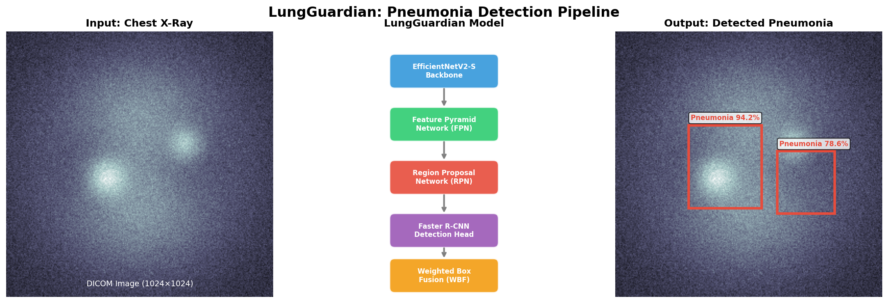
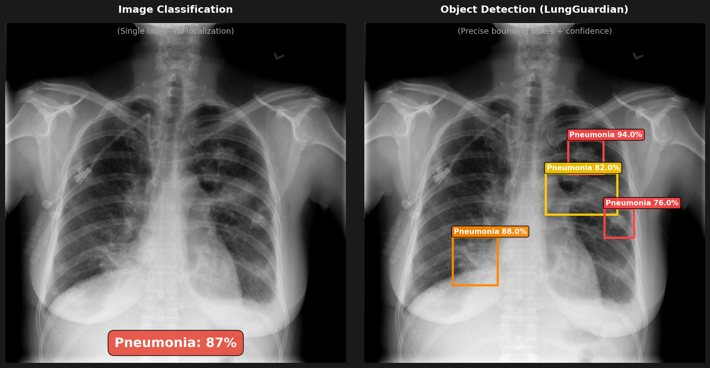
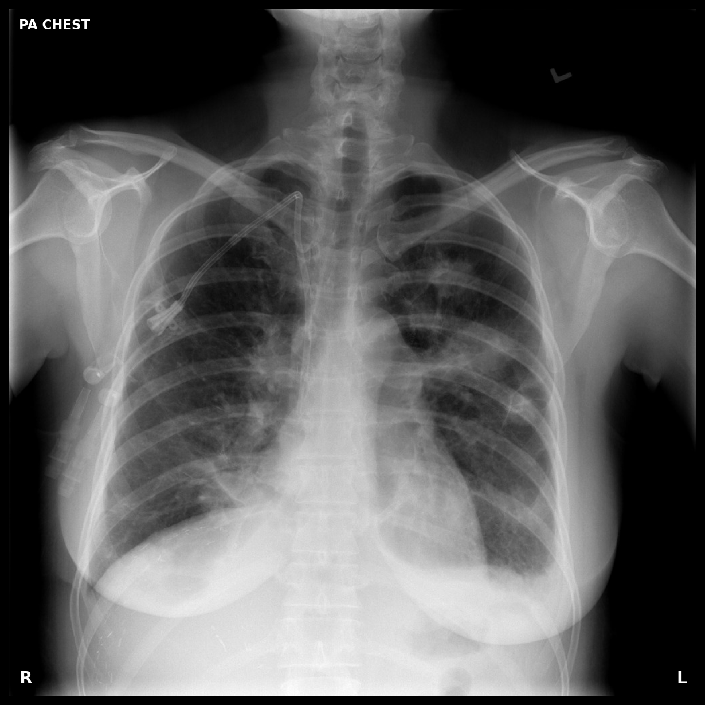
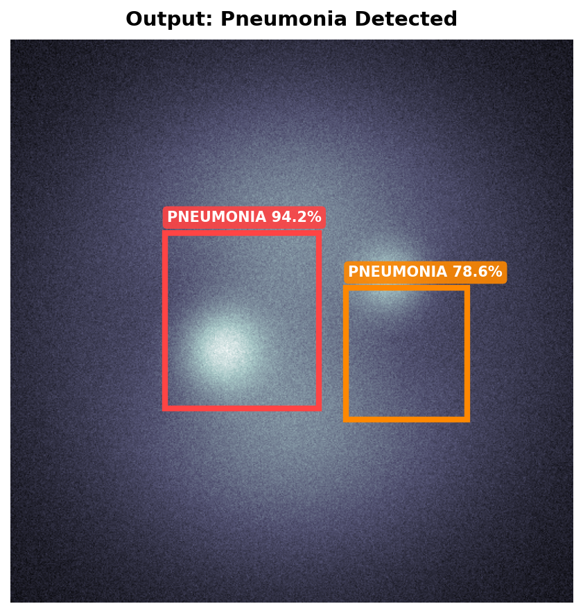

# LungGuardian

Pneumonia detection from chest X-rays using Faster R-CNN with EfficientNetV2 backbone. Built for the [RSNA Pneumonia Detection Challenge](https://www.kaggle.com/c/rsna-pneumonia-detection-challenge).

<p align="center">
  
</p>

## What it does

This is an **object detection** model, not a classifier. It finds and localizes pneumonia opacities in chest X-rays with bounding boxes.

<p align="center">
  
</p>

| Input | Output |
|:-----:|:------:|
|  |  |

## Tech stack

| Component | Choice | Why |
|-----------|--------|-----|
| Backbone | EfficientNetV2-S | Better accuracy/speed than ResNet |
| Detector | Faster R-CNN + FPN | Multi-scale detection |
| Loss | Focal Loss | Handles 95%+ background anchors |
| Post-processing | Weighted Box Fusion | Better than NMS for overlapping boxes |
| Augmentation | Albumentations + Mosaic | Robust to variations |
| CV Strategy | StratifiedGroupKFold | No patient leakage between folds |

## Setup

```bash
git clone https://github.com/yourusername/LungGuardian.git
cd LungGuardian
pip install -r requirements.txt
```

Download the [RSNA dataset](https://www.kaggle.com/c/rsna-pneumonia-detection-challenge/data) and extract to `data/rsna/`.

### Requirements

- Python 3.8+
- PyTorch 2.0+
- CUDA 11.0+ (for GPU)
- ~8GB VRAM

## Training

```bash
# Single fold
python notebooks/04_training_engine.py --fold 0 --epochs 15

# All 5 folds
python notebooks/04_training_engine.py --all_folds

# Resume from checkpoint
python notebooks/04_training_engine.py --fold 0 --resume checkpoints/run_xxx/best_model.pt
```

## Project structure

```
├── notebooks/
│   ├── 01_data_pipeline.py        # DICOM loading, augmentation, StratifiedGroupKFold
│   ├── 02_model_architecture.py   # EfficientNetV2 + FPN + Faster R-CNN
│   ├── 03_losses_and_utilities.py # Focal loss, WBF, IoU, mAP
│   └── 04_training_engine.py      # Training loop with AMP, scheduling
├── assets/                        # Demo images
├── checkpoints/                   # Saved models (gitignored)
├── requirements.txt
└── README.md
```

## Config

| Param | Value | Notes |
|-------|-------|-------|
| Image size | 1024×1024 | Native RSNA resolution |
| Batch size | 4 | Gradient accumulation = 4 (effective 16) |
| LR backbone | 1e-5 | Lower LR for pretrained layers |
| LR head | 1e-4 | Higher LR for new layers |
| Scheduler | Cosine + warmup | 2 epoch warmup |
| Epochs | 15 | Early stopping with patience=5 |
| AMP | Enabled | ~2x faster, 50% less memory |

## Data pipeline

The RSNA dataset has some quirks this code handles:
- Multiple bounding boxes per image (grouped by patientId)
- ~26% positive rate (handled via Focal Loss)
- Same patient can't be in train AND val (StratifiedGroupKFold)

Augmentations: HorizontalFlip, ShiftScaleRotate, RandomBrightnessContrast, CLAHE, GaussNoise, Mosaic (30% prob)

## Inference

```python
model = create_efficientnetv2_s_fasterrcnn(num_classes=2)
model.load_state_dict(torch.load('best_model.pt')['model_state_dict'])
model.eval()

with torch.no_grad():
    preds = model([image_tensor])

# Apply WBF to merge overlapping boxes
preds = apply_wbf(preds, image_size=1024, iou_thr=0.5)
```

## References

- [EfficientNetV2](https://arxiv.org/abs/2104.00298) - Tan & Le, 2021
- [Faster R-CNN](https://arxiv.org/abs/1506.01497) - Ren et al., 2015
- [Feature Pyramid Networks](https://arxiv.org/abs/1612.03144) - Lin et al., 2017
- [Focal Loss](https://arxiv.org/abs/1708.02002) - Lin et al., 2017
- [Weighted Box Fusion](https://arxiv.org/abs/1910.13302) - Solovyev et al., 2021

## License

MIT
